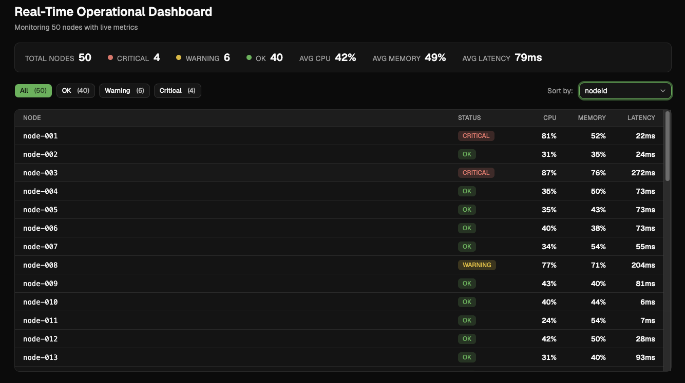

# Real-Time Operational Dashboard



A frontend prototype for monitoring a fleet of nodes in real time. It receives a high-frequency stream of metrics over a WebSocket and shows an overview, a filterable and sortable list of nodes, and a live chart for the selected node.

- **Overview bar:** total nodes, critical / warning / OK counts, average CPU, memory and latency.
- **Node list:** filter by status, sort by node id, CPU, memory or latency. The list is virtualized, so it stays fast with thousands of nodes.
- **Node detail:** click a row to see its current metrics and a live line chart of its latest readings.
- **Light and dark themes:** follows the operating system setting.

Design decisions, trade-offs and the scaling plan are in [ARCHITECTURE.md](./ARCHITECTURE.md).

## Quick start (Docker)

The only requirement is Docker with Docker Compose. No local `node_modules` are needed.

```bash
docker-compose up --build
```

Then open <http://localhost:3000>.

| Service    | Port | Description                                              |
| ---------- | ---- | -------------------------------------------------------- |
| `frontend` | 3000 | The built React app, served by nginx                     |
| `server`   | 3001 | Mock WebSocket server (also has `GET /health`)           |

Stop everything with `Ctrl+C`, or `docker-compose down` if it runs in the background (`docker-compose up -d --build`).

## Local development (optional)

Requires Node.js 22.12 or newer (the Docker images use Node 24).

```bash
npm install
npm run server   # mock WebSocket server on ws://localhost:3001
npm run dev      # Vite dev server on http://localhost:5173
```

| Variable       | Where                 | Default               | Purpose                                                    |
| -------------- | --------------------- | --------------------- | ---------------------------------------------------------- |
| `NODE_COUNT`   | mock server           | `50`                  | Number of simulated nodes (e.g. `NODE_COUNT=1500` to load test) |
| `VITE_WS_URL`  | frontend, build time  | `ws://localhost:3001` | WebSocket URL the browser connects to                      |

The mock server sends a snapshot every 500 ms. Only some nodes change in each snapshot, and now and then a node has an incident (a latency or CPU spike) and recovers gradually.

## Tests

```bash
npm test        # unit and component tests (Vitest + React Testing Library)
npm run lint    # oxlint
```

End-to-end tests use Cypress and run against the app on port 3000, so start the stack first:

```bash
docker-compose up -d --build
npm install          # also downloads the Cypress binary
npm run e2e          # headless run
npm run e2e:open     # interactive runner
```

To run them against the Vite dev server instead, use `CYPRESS_BASE_URL=http://localhost:5173 npm run e2e`.

The E2E suite covers filtering by CRITICAL and inspecting a node's telemetry. Those tests use a fake WebSocket with fixed data, so they do not depend on the random mock server. One extra test checks that the real mock server delivers nodes to the page.

## Project structure

```
src/
├── App.tsx                  Composes the dashboard
├── components/
│   ├── ui/                  Design system primitives
│   └── *.tsx                Feature components
├── hooks/                   Connection, filtering, selection, history
├── stores/metricsStore.ts   Zustand store and selectors
├── services/
│   ├── websocket/           WebSocket client and snapshot parser
│   └── mockServer/          Mock server and data generator
├── types/metrics.ts         Shared types
└── test/                    Test helpers
cypress/e2e/                 End-to-end tests
```

`components/ui/` holds the generic building blocks (Badge, Button, Select, MetricCard, StatsBar). The feature components (NodeList, NodeRow, NodeDetail, ...) are built on top of them.

## Stack

React 19, TypeScript (strict), Zustand, Tailwind CSS v4 with shadcn-style components, Recharts, TanStack Virtual, Vite, Vitest, Cypress, Docker (multi-stage build) and nginx.
